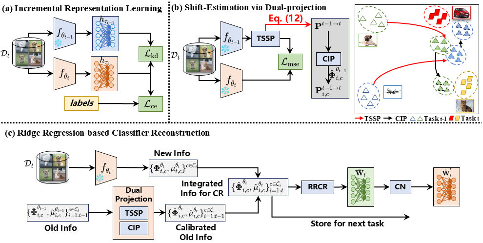

<div align="center">
  
# 【ICML' 2025】Semantic Shift Estimation via Dual-Projection and Classifier Reconstruction for Exemplar-Free Class-Incremental Learning
###  Run He, Di Fang, Yicheng Xu, Yawen Cui, Ming Li, Cen Chen, Ziqian Zeng, Huiping Zhuang* 
  
</div>

## Introduction
The official implementation for [Semantic Shift Estimation via Dual-Projection and Classifier Reconstruction for Exemplar-Free Class-Incremental Learning](https://arxiv.org/abs/2503.05423) in PyTorch.

## Abstract
Exemplar-Free Class-Incremental Learning (EFCIL) aims to sequentially learn from distinct categories without retaining exemplars but easily suffers from catastrophic forgetting of learned knowledge. While existing EFCIL methods leverage knowledge distillation to alleviate forgetting, they still face two critical challenges: semantic shift and decision bias. Specifically, the embeddings of old tasks shift in the embedding space after learning new tasks, and the classifier becomes biased towards new tasks due to training solely with new data, hindering the balance between old and new knowledge. To address these issues, we propose the Dual-Projection Shift Estimation and Classifier Reconstruction (DPCR) approach for EFCIL. DPCR effectively estimates semantic shift through a dual-projection, which combines a learnable transformation with a row-space projection to capture both task-wise and category-wise shifts. Furthermore, to mitigate decision bias, DPCR employs ridge regression to reformulate a classifier reconstruction process. This reconstruction exploits previous in covariance and prototype of each class after calibration with estimated shift, thereby reducing decision bias. Extensive experiments demonstrate that, on various datasets, DPCR effectively balances old and new tasks, outperforming state-of-the-art EFCIL methods.

## Overview

<div align="center">

</div>

## Quick Start

### Setup code environment

See the details in [environment.yaml](environment.yaml)

A suitable [conda](https://conda.io/) environment named `dpcr` can be created and activated with:
```Bash
   conda env create -f environment.yaml
   conda activate dpcr
```

### Datasets

We provide the implementation on five benchmark datasets reported in the paper, i.e., CIFAR-100, and Tiny-ImageNet, ImageNet-100, CUB-200, and ImageNet-1k. 

You should define your directory to the dataset in [utils/data.py](utils/data.py).

### Run

You can run the experiments via the follow code.

```Bash
   python main.py --config ./exps/[your_configuration.json]
```
You can also change the settings in the .json file for different experiments. 

Part of arguments are listed followed.
- `dataset`: The dataset used in the experiment
- `init_cls`: The number of classses in the first task.
- `increment`: The number of classses of each task.
- `convnet_type`: Type of model used in the experiment, ResNet-18 by default. 
- `resume`: Choose whether to used the pre-trained weight.
- `model_dir`: Directory that store the model checkpoint or load the pre-trained weight (when resume=True). 
- `rg`: Regularization factor $\gamma$.
- `rg_tssp`: The regularization term in the TSSP, 1e-9 by default.


## Analytic Continual Learning

Our work belongs to the branch of analytic continual learning, you can find other works at "[Analytic Continual Learning.](https://github.com/ZHUANGHP/Analytic-continual-learning)".

## Dual Branch

We have a dual branch at "[Analytic Federated Learning.](https://github.com/ZHUANGHP/Analytic-federated-learning)" 

## Acknowledgment

The implementation of the codes is partly referred to [PyCIL](https://github.com/TsingZ0/PFLlib) and [ADC](https://github.com/dipamgoswami/ADC). We sincerely appreciate for their contributions.

## Cite Our Paper
If you find this paper useful, please consider staring this repo and citing our paper:
```bib
@misc{He_2025_DPCR,
      title={Semantic Shift Estimation via Dual-Projection and Classifier Reconstruction for Exemplar-Free Class-Incremental Learning}, 
      author={Run He and Di Fang and Yicheng Xu and Yawen Cui and Ming Li and Cen Chen and Ziqian Zeng and Huiping Zhuang},
      year={2025},
      eprint={2503.05423},
      archivePrefix={arXiv},
      primaryClass={cs.CV},
      url={https://arxiv.org/abs/2503.05423}, 
}
```
